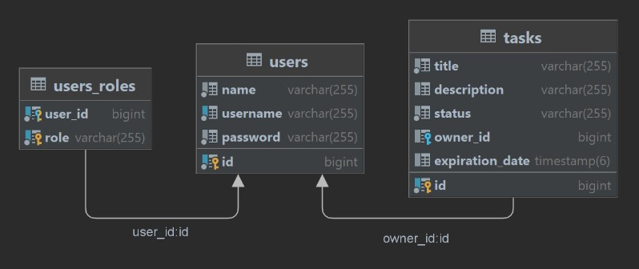

# Tasklist

Приложение создано для помощи в организации управления задачами.

Ознакомиться со списком доступных конечных точек можно 
через веб-интерфейс приложения `http://localhost:8080/swagger-ui/index.html`.

## Стек:
- Java 17 (Core, Collections, Optional, Stream)
- Spring Boot
- Spring Security, JWT, Security expressions
- JDBC, JPA Hibernate
- PostgreSQL, Flyway, Redis
- Maven
- Lombok, MapStruct, Swagger
- JUnit, Mockito, TestContainer
- Docker, Docker Compose
- CI/CD with GitHub actions

## Схема базы данных

В приложении используются два базовых класса - **User** и **Task**.

Класс **User** представляет пользователя приложения. Он используется для логина, 
создания и обновления задач. Может иметь роли `ROLE_ADMIN` и `ROLE_USER`.

Класс **Task** представляет задачу пользователя приложения. Может быть создан только 
существующим пользователем.

## Environments
Для запуска приложения требуется создать в корне файл `.env` и настроить переменные:

- `POSTGRES_HOST` - хост с базой данных PostgreSQL
- `POSTGRES_DATABASE` - имя базы данных PostgreSQL
- `POSTGRES_SCHEMA`- название используемой схемы базы данных PostgreSQL
- `POSTGRES_USERNAME` - имя пользователя для подключения к базе данных PostgreSQL
- `POSTGRES_PASSWORD` - пароль для подключения кк базе данных PostgreSQL
- `REDIS_HOST` - хост с базой данных Redis
- `REDIS_PASSWORD` - пароль для подключения к базе данных Redis
- `JWT_SECRET` - секретная строка для JWT токенов

При желании можно использовать базовые настройки из файла `.env.example`.
